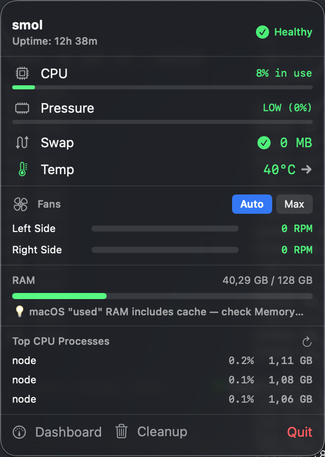

<p align="center">
  
  
  
  
  
</p>

<h1 align="center">
  <br>
  smol
  <br>
</h1>

<h4 align="center">A tiny Mac monitor that actually works. Free. Open Source. No bullshit.</h4>

<p align="center">
  <em>"CleanMyMac uses 500MB to tell you your Mac is dirty. smol uses 5MB to tell you the truth."</em>
</p>

<p align="center">
  
</p>

<p align="center">
  
</p>

---

## Why smol exists

I discovered that:
- **Logitech Options+** was running at 70% CPU for **10 months** straight
- **CleanMyMac** was using **11 GB of RAM** to "protect" me
- **Adobe Creative Cloud** had 16+ background processes doing absolutely nothing

After freeing 62 GB of RAM and dropping temperature by 40°C, I built this.

---

## Philosophy

Most system monitors show you scary numbers. smol shows you what actually matters.

| What others show | What smol shows | Why |
|:---|:---|:---|
| "29 GB RAM used!!!" | Memory Pressure: **LOW** | GB used means nothing on macOS |
| "CPU 85%!!!" | CPU: **15%** | Shows actual work, not panic |
| Nothing about swap | Swap: **0 MB** | Swap > 0 = real problem |
| "Temperature: High" | **52°C** ↓ | Actual degrees + trend |

---

## Features

### System Monitoring
- **Menu bar widget** — changes color based on real system health (green/yellow/red)
- **CPU, Memory, Temperature, Swap** — the metrics that actually matter
- **Fan control** — monitor and set fan speeds on supported Macs via SMC
- **Process analysis** — find what's actually eating your resources

### AI Assistant
Three AI backends with automatic fallback:

| Backend | Requirements | Cost |
|:---|:---|:---|
| **Apple AI** | macOS 26+, Apple Silicon | Free, on-device |
| **MLX** | Apple Silicon, model download | Free, on-device |
| **Cloud** | API key (OpenRouter/Together/Groq/OpenAI) | Pay per use |

If no backend is available, smol still works with built-in template responses.

Features:
- **Streaming chat** — tokens appear in real-time
- **System context** — AI knows your current CPU, memory, temp, anomalies
- **ML anomaly detection** — CoreML-based pattern learning (trains on your usage)
- **Natural language** — ask "why is my Mac slow?" and get a real answer

### Cleanup & Detection
- **Ghost process detection** — finds processes hogging CPU for too long
- **Bloatware database** — knows problematic apps (Logitech, CleanMyMac, Adobe CC...)
- **Cleanup tool** — finds orphaned LaunchAgents and leftover folders

---

## Install

### Download
Signed `.dmg` coming with the first [GitHub Release](https://github.com/al0x99/smol/releases). Until then, build from source — it's fast.

### Build from source
```bash
git clone https://github.com/al0x99/smol.git
cd smol
open smol.xcodeproj
# Build & Run (Cmd+R)
```

**Requirements:** Xcode 26+, macOS 26 (Tahoe). The Apple AI backend uses `FoundationModels`, which is macOS 26-only.

> **Note on MLX backend:** to enable on-device MLX inference, add the [`mlx-swift`](https://github.com/ml-explore/mlx-swift) SPM dependency in Xcode (*File → Add Package Dependencies*) and attach `MLX`, `MLXNN`, `MLXRandom` to the `smol` target. Without it, the MLX engine falls back to placeholder responses — the rest of the app works fine.

### Build a signed, notarized DMG
See [`scripts/release.sh`](scripts/release.sh). Requires a **Developer ID Application** certificate and a stored notarytool profile:

```bash
xcrun notarytool store-credentials smol-notary \
  --apple-id you@example.com --team-id TEAMID --password <app-specific-password>

DEV_ID_APPLICATION="Developer ID Application: Your Name (TEAMID)" \
NOTARY_PROFILE=smol-notary \
scripts/release.sh 1.0.0
```

---

## Size comparison

| App | Disk Size | RAM Usage |
|:---|:---|:---|
| CleanMyMac X | ~500 MB | 200+ MB |
| iStat Menus | ~50 MB | ~80 MB |
| **smol** | **~5 MB** | **~15 MB** |

---

## Architecture

```
smol.app
├── Menu Bar Widget (real-time status, color-coded)
├── Dashboard (NavigationSplitView sidebar)
│   ├── Overview — CPU, Memory, Swap, Temperature
│   ├── Processes — top consumers, ghost detection
│   ├── Alerts — anomaly detection, bloatware warnings
│   ├── Temperature — all sensors, fan speeds
│   ├── Fans — speed control via SMC (privileged helper)
│   ├── System — hardware info, uptime
│   ├── AI Assistant — chat, insights, reports, models
│   └── Settings — refresh rate, notifications, AI backend
├── Services
│   ├── SystemMonitor — IOKit/Mach for real metrics
│   ├── TemperatureMonitor — SMC sensor reading
│   ├── SmartAdvisor — AI analysis engine
│   ├── MLAnomalyEngine — CoreML pattern detection
│   ├── LLMInference/ — multi-backend AI
│   │   ├── FoundationModelEngine — Apple AI (macOS 26+)
│   │   ├── MLXEngine — on-device via mlx-swift
│   │   └── OpenRouterEngine — cloud SSE streaming
│   └── KeychainHelper — secure API key storage
└── XPC Helper (com.smol.fanhelper) — privileged fan control
```

### Apple Silicon SMC notes

Intel Macs and Apple Silicon expose fan data through different SMC key formats. On M-series machines, RPM values live in keys like `F0Ac`/`F1Ac` encoded as **IEEE 754 float (`flt`)**, not the fixed-point `fpe2` used on Intel. Writing to `F0Tg` / `F1Tg` starts the fans even when the current RPM is `0`. This is why smol ships its own SMC reader via a privileged XPC helper — published SMC wrappers are still Intel-era.

---

## AI Backend Setup

### Apple AI (macOS 26+)
Zero configuration. If you're on macOS Tahoe with Apple Intelligence enabled, it just works.

### MLX (Apple Silicon)
1. Add the `mlx-swift` SPM package to the project (see *Build from source*)
2. Go to **AI Assistant → Models**
3. Download an MLX model (e.g. Gemma 2 2B — 1.5 GB)
4. Start chatting

### Cloud (OpenRouter)
1. Go to **Settings → AI Backend**
2. Paste your API key
3. Pick a provider (OpenRouter, Together, Groq, OpenAI)
4. Test connection

---

## Why not App Store?

Reading CPU temperature requires direct SMC access via IOKit, which isn't allowed in the App Store sandbox. smol is signed and notarized by Apple — just not sandboxed.

---

## Tech Stack

- **Swift 6** + **SwiftUI** — native macOS, no Electron
- **IOKit** — direct hardware access for temperature/fans
- **CoreML / CreateML** — on-device anomaly detection
- **NaturalLanguage** — intent detection, sentiment analysis
- **FoundationModels** — Apple's on-device LLM (macOS 26+)
- **Security.framework** — Keychain for API keys
- **XPC / SMJobBless** — privileged helper for fan control

---

## Contributing

PRs welcome. Especially for:
- Adding apps to the bloatware database (`smol/KnownBloatware.json`)
- Improving anomaly detection algorithms
- New Apple Silicon sensor support
- Translations

---

## License

[MIT](LICENSE) — Do whatever you want, just don't become bloatware yourself.

---

<p align="center">
  <sub>Made with frustration and Swift.</sub>
</p>
